# Human Resource Data Analysis with SQL Server & Power BI – 2022

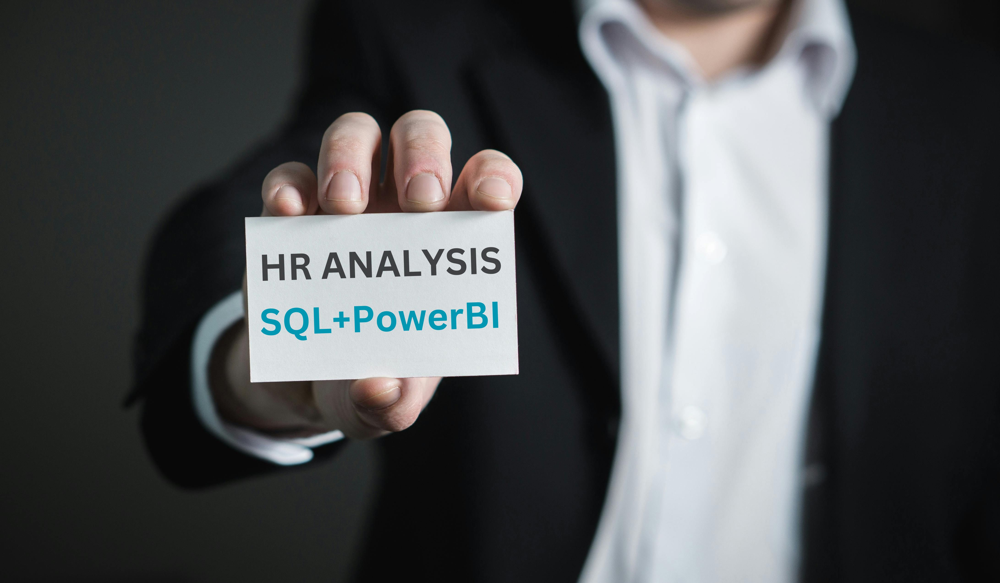

## Introduction 
Welcome to an HR analysis of employee demographics and retention at Robel Group of Companies. This project is an exhibition of my analytics skills using SQL and Power BI to discover important human resource insights that can greatly benefit the company. In this report, we will delve into various aspects of the company's workforce, aiming to provide insights into age distribution, gender breakdown, racial diversity, tenure, turnover rates, remote work arrangements, geographical distribution, job titles, and hiring trends over time.

_**PLEASE TAKE NOTE:** The dataset is just a dummy mock data and does not represent any real company, institution, or country. It is for the purpose of demonstrating my analytics skills._

## Problem Statement

The following questions are to be answered:
1. What is the age distribution in the company?
2. What is the gender breakdown in the company?
3. How does gender vary across departments and job titles?
4. What is the race distribution in the company?
5. What is the average length of employment in the company?
6. Which department has the highest turnover rate?
7. What is the tenure distribution for each department?
8. How many employees work remotely for each department?
9. What is the distribution of employees across different states?
10. How are job titles distributed in the company?
11. How have employee hire counts varied over time?

## Data Sourcing

I came across the dataset online which was locally saved in CSV file format. The data was exported into SQL Server for data cleaning and exploratory data analysis.

## Data Assessment & Cleaning
The data was assessed and cleaned on SQL Server 2022.

The processes included:
- Data loading & inspection
- Handling missing values
- Validating Data types
- Data transformation and analysis

## Tasks Involved in the Data Cleaning Process

### 1. Create Database

```sql
CREATE DATABASE hr_db;
```

Refresh page to reveal the newly created database


### 2. Import Data to SQL Server

- Right-click on hr_db > Tasks > Import Flat File

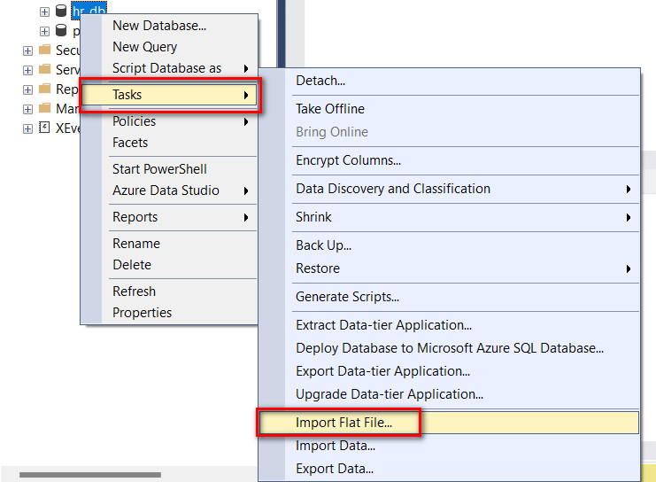

- An import wizard will pop-up then you click the `Next` button at the bottom right

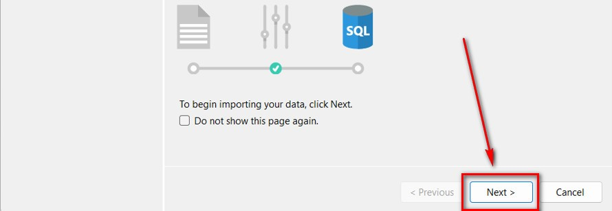

- Click `Browse` to fetch the CSV file then click `Next` to continue

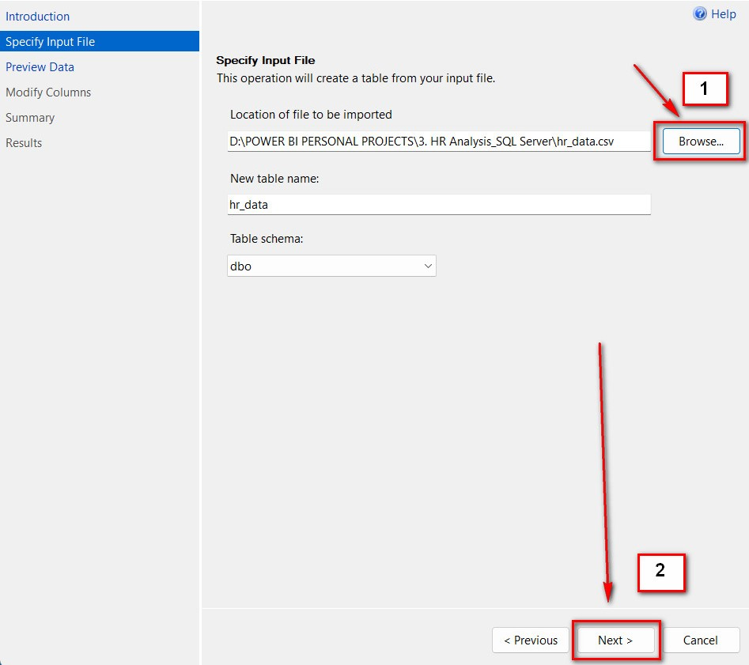

- Click `Next` on the following page


- Click `Next` button on the next page


- Click the `Finish` button bottom-right to start uploading file


- Once the upload is successful, you should see **"Operation Complete"** wizard showing success.

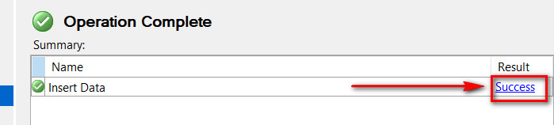

- Verify that the import worked using the queries below:

```sql
USE hr_db; 
```

```sql
SELECT *
FROM hr_data;  
```

After importing the file and verifying, I selected all fields from the `hr_data` table, and I noticed that the output recorded **22,214 rows** and **13 columns.**

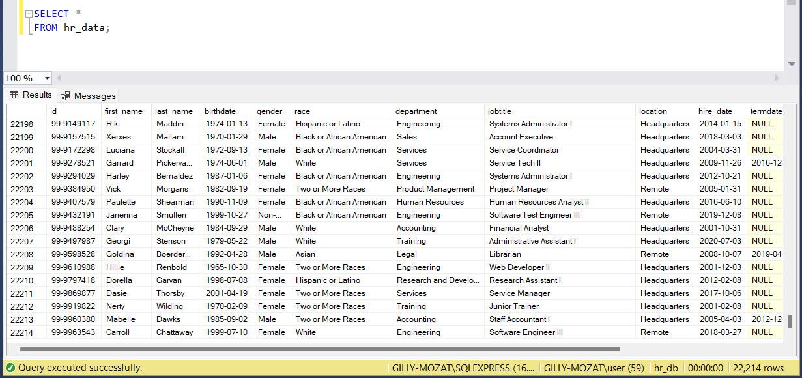

### 3. Data Transformation

The `termdate` column which contains termination dates was imported as nvarchar(50), hence it needed to be converted into the date format. Before I converted the data type of the `termdate` column, I decided to sort them and see how the dates look like. I noticed inaccuracy with some of the dates which happened to be in the futre, so I had to correct this error by formatting the date/time. 

Below is the query I executed to check the termdate error:

```sql
SELECT termdate
FROM hr_data
ORDER BY termdate DESC;
```
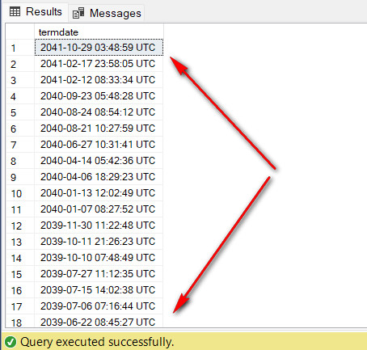

I updated the termdate date/time to date using the following steps:

###### a) converted dates to yyyy-mm-dd
###### b) created new column labeled `new_termdate`
###### c) copied converted time values from termdate to new_termdate

### a) converted dates to yyyy-mm-dd

```sql
UPDATE hr_data
SET termdate = FORMAT(CONVERT(DATETIME, LEFT(termdate, 19), 120), 'yyyy-mm-dd');
```

### b) created new column labeled new_termdate

Because you cannot directly convert data types of columns in SQL Server, I had to create a new column labeled `new_termdate` which I set the data type as DATE.

```sql
ALTER TABLE hr_data
ADD new_termdate DATE;
```

### c) copied converted time values from termdate to new_termdate

```sql
UPDATE hr_data
SET new_termdate = CASE
 WHEN termdate IS NOT NULL AND ISDATE(termdate) = 1 THEN CAST(termdate AS DATETIME) ELSE NULL
 END;
 ```

 I checked the result of the new_termdate:

 ```sql
 SELECT new_termdate
FROM hr_data;
```

#### I createa a new column labeled "age"

```sql
ALTER TABLE hr_data
ADD age nvarchar(50);
```

#### I populated the new `age` column with age using the query below

```sql
UPDATE hr_data
SET age = DATEDIFF(YEAR, birthdate, GETDATE());
```

## Exploratory Data Analysis

**1. What is the age distribution in the company?**
- age distribution

```sql
SELECT
  MIN(age) AS Youngest,
  MAX(age) AS Oldest
FROM hr_data;
```
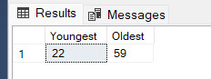

- age group count

```sql
SELECT age_group,
count(*) AS count
FROM
(SELECT 
 CASE
  WHEN age <= 22 AND age <= 30 THEN '22 to 30'
  WHEN age <= 31 AND age <= 40 THEN '31 to 40'
  WHEN age <= 41 AND age <= 50 THEN '41 to 50'
  ELSE '50+'
  END AS age_group
 FROM hr_data
 WHERE new_termdate IS NOT NULL
 ) AS subquery
GROUP BY age_group
ORDER BY age_group;
```

- age group distribution by gender

```sql
SELECT age_group,
gender,
count(*) AS count
FROM
(SELECT 
 CASE
  WHEN age <= 22 AND age <= 30 THEN '22 to 30'
  WHEN age <= 31 AND age <= 40 THEN '31 to 40'
  WHEN age <= 41 AND age <= 50 THEN '41 to 50'
  ELSE '50+'
  END AS age_group,
  gender
 FROM hr_data
 WHERE new_termdate IS NULL
 ) AS subquery
GROUP BY age_group, gender
ORDER BY age_group, gender;
```

**2. What is the gender breakdown in the company?**

```sql
SELECT
 gender,
 COUNT(gender) AS count
FROM hr_data
WHERE new_termdate IS NULL
GROUP BY gender
ORDER BY count DESC;
```
**3. How does gender vary across departments and job titles?**

- gender by department

```sql
-- How gender vary dept and job titles
SELECT 
department,
gender,
COUNT(gender) AS count
FROM hr_data
WHERE new_termdate IS NULL
GROUP BY department, gender
ORDER BY department, gender ASC;
```

- gender by job titles

```sql
SELECT 
department, jobtitle,
gender,
count(gender) AS count
FROM hr_data
WHERE new_termdate IS NULL
GROUP BY department, jobtitle, gender
ORDER BY department, jobtitle, gender ASC;
```

**4. What is the race distribution in the company?**

```sql
SELECT race,
 count(*) AS count
FROM hr_data
WHERE new_termdate IS NULL 
GROUP BY race
ORDER BY count DESC;
```

**5. What is the average length of employment in the company?**

```sql
SELECT 
AVG(DATEDIFF(year, hire_date, new_termdate)) AS avg_tenure
FROM hr_data
WHERE new_termdate IS NOT NULL AND new_termdate <= GETDATE();
```

**6. Which department has the highest turnover rate?**

- get total count
- get terminated count
- terminated count/total count

```sql
SELECT
 department,
 total_count,
 terminated_count,
 (round((CAST(terminated_count AS FLOAT)/total_count), 2)) * 100 AS turnover_rate
 FROM
	(SELECT 
	 department,
	 count(*) AS total_count,
	 SUM(CASE
		WHEN new_termdate IS NOT NULL AND new_termdate <= GETDATE() THEN 1 ELSE 0
		END
		) AS terminated_count
	FROM hr_data
	GROUP BY department
	) AS subquery
ORDER BY turnover_rate DESC;
```

**7. What is the tenure distribution for each department?**

```sql
SELECT department,
AVG(DATEDIFF(year, hire_date, new_termdate)) AS avg_tenure
FROM hr_data
WHERE new_termdate IS NOT NULL AND new_termdate <= GETDATE()
GROUP BY department
ORDER BY avg_tenure DESC;
```

**8. How many employees work remotely for each department?**

```sql
SELECT
 location,
 count(*) as count
FROM hr_data
WHERE new_termdate IS NULL
GROUP BY location;
```

**9. What is the distribution of employees across different states?**

```sql
SELECT 
 location_state,
 count(*) AS count
FROM hr_data
WHERE new_termdate IS NULL
GROUP BY location_state
ORDER BY count DESC;
```

**10. How are job titles distributed in the company?**

```sql
SELECT 
 jobtitle,
 count(*) AS count
 FROM hr_data
 WHERE new_termdate IS NULL
 GROUP BY jobtitle
 ORDER BY count DESC;
 ```

 **11. How have employee hire counts varied over time?**

- calculated hires
- calculated terminations
- (hires-terminations)/hires * percent hire change

```sql
 SELECT
 hire_year,
 hires,
 terminations,
 hires - terminations AS net_change,
 (round(CAST(hires-terminations AS FLOAT)/hires, 2)) * 100 AS percent_hire_change
 FROM
	(SELECT 
	 YEAR(hire_date) AS hire_year,
	 count(*) AS hires,
	 SUM(CASE
			WHEN new_termdate is not null and new_termdate <= GETDATE() THEN 1 ELSE 0
			END
			) AS terminations
	FROM hr_data
	GROUP BY YEAR(hire_date)
	) AS subquery
ORDER BY percent_hire_change ASC;
```
***

# Power BI
I exported the fact table, including all the dimension tables of the exploratory data analysis into Power BI for modeling, visualization, and a more detailed analysis.

## Data Modeling

A relationship was automatically created by Power BI, however, I verified to ensure accuracy. I noticed that star schema (1:*) relationships were created with a connection of the dimension tables to the main table. Below is a preview of the model:

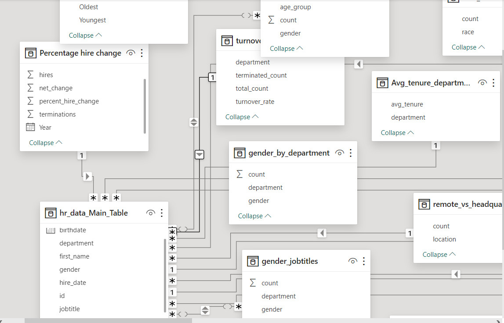

## Visualization

[Click here](https://app.powerbi.com/view?r=eyJrIjoiY2Q2MzE5MmEtZWQxNC00NjRmLWFlZTAtOTI5ZTFlYmQ3ZTBhIiwidCI6ImZkMjljODFlLWI1YzUtNDAzNS1hZGIyLTBmMGJjODhiMzM2NyJ9) to interact with the report.

- **Gender Group Distribution page**

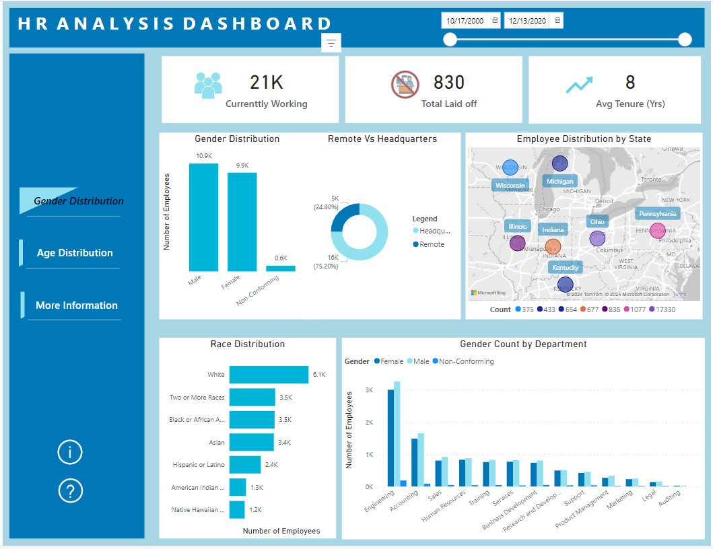

- **Age Group Distribution page**

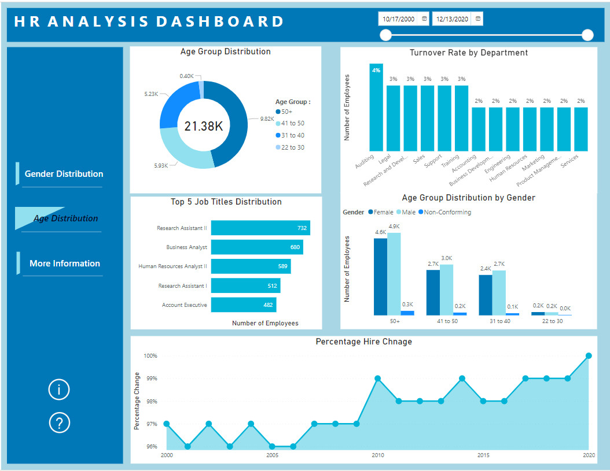

## Insights & Recommendations

### Insights:

- Youngest employee is 22 years and oldest is 59 years old. Significant portion of the employees happen to be in the age of 50 years and above. While the younger employees (22-30 years old) are fewest.

- There are more male employees than female or non-conforming employees. Males are 10864 in number, females are 9942, and non-conforming are 578.

- Various genders are fairly distributed across departments. Overall, male employees are slightly more.

- The Caucasian race recorded the higher number of employees, a total of 6,091, followed by the other racial groups.

- The average length of employment is 8 years.   

- The Auditing department has the highest turnover rate of 4%, followed by Legal, Research & Development and Sales. Product Management & Services have the lowest turnover rates.

- Employees tend to stay with the company for 7-9 years, with tenure evenly distributed across departments.

- A significant portion (25%) of employees work remotely, indicating the importance of flexible work arrangements.

- Ohio records the majority of employees, the number of 17,330, followed by all other states in the region.

- There are 184 job titles in the company, with Research Assistant II taking most of the employees having the number of 732 employees, and Business Analyst (680), Human Resource Analyst II (589), Research Assistant I (512), and VP of Training and Development taking just 1 employee each. 

- Employee hire counts have consistently increased over the years, indicating the company’s growth and expansion.

### Recommendations 

- You can implement initiatives to attract and retain younger talent, such as career development programs and flexible work arrangements tailored to their needs.

- Continue to foster an inclusive and diverse workplace culture and gender-neutral policies.

- Conduct regular gender pay equity checks and ensure equal opportunities for career advancement and leadership roles across all departments.

- Enhance diversity recruitment efforts by implementing targeted outreach programs and partnerships with diverse communities to ensure a more representative workforce.

- Recognize and reward long-serving employees through retention programs, career progression opportunities, and personalized recognition initiatives.

- Conduct exit interviews to identify reasons for turnover and implement strategies to address employee concerns, such as improving work-life balance, and providing professional development opportunities.

- Foster a supportive work environment that promotes employee engagement, satisfaction, and loyalty through regular feedback mechanisms, career growth opportunities, and wellness programs.

- Continue supporting remote work initiatives and invest in technology infrastructure to facilitate seamless collaboration and communication among remote teams.

- Consider establishing satellite offices or remote work hubs in regions with lower employee concentrations to tap into diverse talent pools and expand organizational footprint.

- Regularly review and update job descriptions to align with evolving business needs and market trends, ensuring clarity in roles and responsibilities to drive employee performance and satisfaction.

- Continue monitoring hiring trends to anticipate future talent needs and develop proactive recruitment strategies aligned with organizational goals and objectives.

## Conclusion

In conclusion, the analysis of employee demographics and retention at Robel Group of Companies has provided valuable insights into the composition of the workforce, retention dynamics, and areas for improvement. By implementing the recommendations outlined above, Robel Group of Companies can strengthen its position as an employer of choice, foster a more inclusive and diverse workplace culture, and drive sustainable growth and success in the ever-evolving business environment.
***

###### Thank you for taking your time to review this project. In case there is any analytics job vacancy or contract based job, you can hit me up via email (mgilbertnana@gmail.com) or [LinkedIn](https://www.linkedin.com/in/gmozu/)

